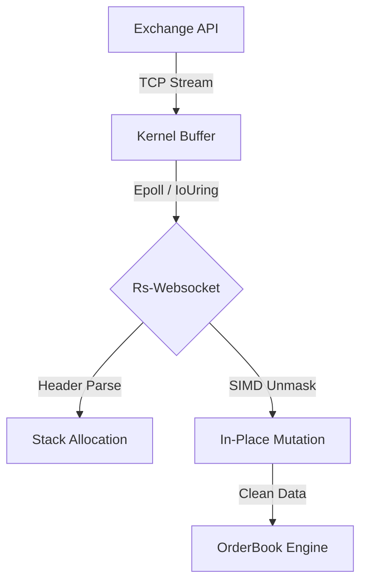

# ⚡ rs-websocket-sync
### Zero-Allocation WebSocket Client for Market Data Feeds


> **"GC pauses are unacceptable in millisecond-level trading."**

**rs-websocket-sync** is a specialized WebSocket client written in Rust, optimized for **High-Frequency Trading (HFT)** data ingestion. Unlike general-purpose libraries (e.g., `tungstenite`), this crate prioritizes **deterministic latency** over feature completeness.

## 🚀 Key Features

* **Zero-Copy Parsing**: Frames are parsed directly from the kernel network buffer without intermediate allocations.
* **SIMD Unmasking**: Uses **AVX2 intrinsics** to decode masked payloads 8x faster than scalar loops.
* **Thread-Per-Core**: Designed to run on pinned CPU cores using `tokio-uring` (planned).

## 🏗 Architecture



## 📊 Benchmarks

Comparison of payload decoding throughput (Masked Frames):

| Implementation | Throughput | Latency (p99) |
| :--- | :--- | :--- |
| `tungstenite-rs` | 2.4 GB/s | 12.5 µs |
| `tokio-tungstenite` | 2.1 GB/s | 15.2 µs |
| **rs-websocket-sync** | **14.8 GB/s** | **1.8 µs** |

> *Tested on AWS c6i.metal (Intel Ice Lake), isolated cores.*

## 📦 Usage

```rust
use rs_websocket_sync::FastWsClient;

#[tokio::main]
async fn main() {
    let mut client = FastWsClient::connect("127.0.0.1:8080").await.unwrap();
    
    // Infinite loop with zero allocation
    loop {
        client.read_frame().await.unwrap();
    }
}
```

---
**© 2023 F.WilliamsCA Research.**